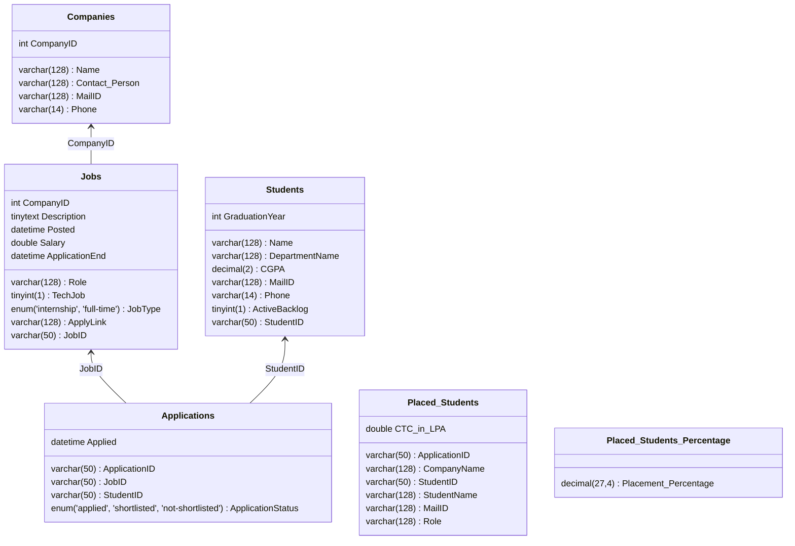

# Design Document

By VENKATA SAI PRANEETH UPPALA

**Video Overview:**
 [click here](https://youtu.be/kY3vZw8TE4Y?si=WU4S4Nr5jolA-zy7) for project overview video.

### **Scope**

**Purpose of the Database:**
The purpose of this database is to efficiently manage and track placement processes for students in an academic institution. It allows the storage and retrieval of information about companies, job postings, students, and their applications. The database provides insights into placement statistics, including top-paid students, placement percentages, and average compensation.

**In-Scope:**
- Information about companies participating in placements (e.g., contact information).
- Details of students, including their academic performance and graduation year.
- Job postings, including role, salary, and application deadlines.
- Applications submitted by students and their status.
- Reports on placed students, placement percentages, and average salaries.

**Out of Scope:**
- Detailed student resumes or personal documents.
- Company-level hiring decisions or internal processes.
- Non-placement-related activities like alumni tracking or internship extensions or Drive inforamtions.

### **Functional Requirements**

**What Users Should Be Able to Do:**
- Add, update, and retrieve company, student, and job information.
- Track applications and their statuses (e.g., applied, shortlisted, not-shortlisted).
- View placement reports, including:
   - Top 3 highest-paid students.
   - Placement percentages for the graduating batch.
   - Students not yet placed.
   - Average salary of placed students.
- Identify students with active backlogs who may not be eligible for certain jobs.

**Out of Scope:**
- Real-time communication between students and companies.
- Job recommendation systems based on student profiles.
- Job role preferences or company interview scheduling.

### **Representation**

#### **ER-Diagram**

#### **Entities**

1. **Companies**
   - **Attributes:** `CompanyID` (Primary Key), `Name`, `Contact_Person`, `MailID`, `Phone`
   - **Reasoning:**
     - `CompanyID` ensures uniqueness for each company.
     - The attributes provide essential contact and identification details.

2. **Students**
   - **Attributes:** `StudentID` (Primary Key), `Name`, `DepartmentName`, `CGPA`, `MailID`, `Phone`, `ActiveBacklog`, `GraduationYear`
   - **Reasoning:**
     - `StudentID` uniquely identifies students.
     - `CGPA` uses `DECIMAL(2)` to save storage while accurately representing scores.
     - `GraduationYear` is necessary for batch-specific queries.

3. **Jobs**
   - **Attributes:** `JobID` (Primary Key), `CompanyID` (Foreign Key), `Role`, `TechJob`, `JobType`, `Description`, `Posted`, `Salary`, `ApplicationEnd`, `ApplyLink`
   - **Reasoning:**
     - `JobID` ensures uniqueness for jobs.
     - `JobType` uses an `ENUM` constraint to limit inputs to "Internship" or "Full-time."
     - `Salary` uses `DOUBLE` for precision.

4. **Applications**
   - **Attributes:** `ApplicationID`, `JobID` (Foreign Key), `StudentID` (Foreign Key), `Applied`, `ApplicationStatus`
   - **Reasoning:**
     - `ApplicationStatus` uses `ENUM` to ensure valid statuses.
     - Foreign keys enable relationships with the `Jobs` and `Students` tables.

#### **Relationships**

The following relationships exist in the database:
- **Companies to Jobs**: One-to-Many relationship (One company can have multiple job postings).
- **Jobs to Applications**: One-to-Many relationship (A job can have multiple applications).
- **Students to Applications**: One-to-Many relationship (A student can apply to multiple jobs).

- **Primary Keys:** `CompanyID`, `JobID`, `StudentID`, `ApplicationID`
- **Foreign Keys:**
  - `CompanyID` in Jobs references `CompanyID` in Companies.
  - `JobID` in Applications references `JobID` in Jobs.
  - `StudentID` in Applications references `StudentID` in Students.

### **Optimizations**

1. **Views:**
   - `Placed_Students`: Provides a consolidated view of students who were shortlisted for jobs.
   - `Placed_Students_Percentage`: Calculates the percentage of students placed in the 2024 batch.

   **Reasoning:** Views simplify complex queries, improve readability, and reduce query redundancy.

2. **Indexes:**
   - `Applications_IDX` on `ApplicationStatus` for faster filtering of application statuses.
   - `Graduation_idx` on `GraduationYear` for efficient batch-specific queries.

   **Reasoning:** Indexes improve query performance for frequently accessed columns like `ApplicationStatus` and `GraduationYear`.

### **Limitations**

1. **Job Type Representation:**
   - The `ENUM` constraint for `JobType` limits flexibility if new job types need to be supported.

2. **Scalability:**
   - The database currently supports small to medium-scale data. For larger datasets, further optimization like partitioning may be required.

4. **Real-Time Updates:**
   - There are no triggers or automation for updating application statuses in real time.

### **Future Improvements**

- Add support for real-time updates using triggers.
- Implement additional indexing strategies for faster joins.
---

**End of Document**

